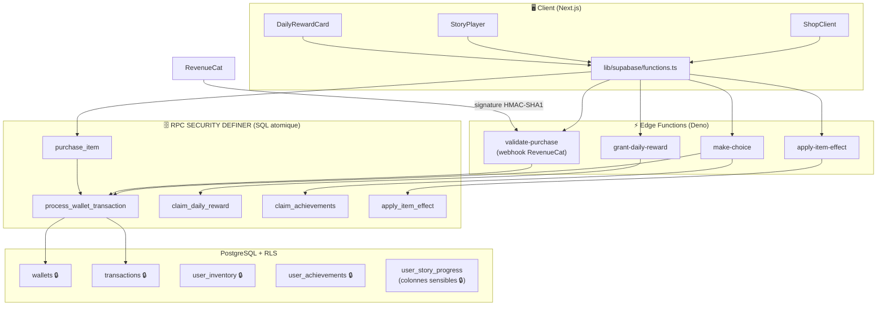

# 🔐 Edge Functions — Sécurisation de la monétisation

> Doc technique · v1.0 · Août 2026 · correspond à `supabase/migrations/004_secure_monetization.sql`

## 1. Le problème résolu

Avant cette itération, la boutique et le moteur de jeu écrivaient **directement**
dans `wallets`, `transactions` et `user_inventory` côté client. N'importe qui
pouvait ouvrir la console du navigateur et s'octroyer des gemmes illimitées :
le projet était inpubliable.

**Règle d'or désormais : le client ne fait plus aucune écriture à valeur
financière.** Tout passe par 4 Edge Functions et 2 RPC `SECURITY DEFINER`
dont la logique vit exclusivement côté serveur.

## 2. Architecture



## 3. Les 4 Edge Functions

| Fonction | Rôle | Entrée | Erreurs notables |
|---|---|---|---|
| `make-choice` | Valide un choix narratif : pré-conditions (`inventory_require`, `flag_require`), débit premium, historique, effets (`stat_modifier`, `flag_set`, `inventory_add`), progression, fins découvertes, +20 💎 de 1ère victoire, succès | `{ choice_id }` | `402 insufficient_funds`, `422 requirement_not_met`, `403 story_locked` |
| `apply-item-effect` | Consomme un objet de la sacoche (vérifie possession + consommable), applique l'effet sur `character_stats`, décrémente l'inventaire | `{ item_id, story_id }` | `404 item_not_owned`, `409 item_not_consumable` |
| `validate-purchase` | **Webhook RevenueCat** (`verify_jwt = false`, signature `X-Signature` HMAC-SHA1 ou `Bearer secret`). Crédite les packs/objets, **idempotent** par `transaction_id`. Contient aussi un mode simulation dev (`{ simulate: true, pack_id }` + JWT) | `{ event }` RC ou `{ simulate, pack_id }` | `401 invalid_signature`, `403 mock_purchases_disabled` |
| `grant-daily-reward` | Récompense quotidienne : streak +1 (ou reset si rupture), 10 💎 + 2/jour (plafond jour 8 = 24 💎) + pièces, idempotent par jour | `{}` | `404 profile_not_found` |

Code : `supabase/functions/<nom>/index.ts` + partagés dans `supabase/functions/_shared/`.

## 4. Les RPC SQL atomiques (migration 004)

| RPC | Accès | Garanties |
|---|---|---|
| `process_wallet_transaction` | `service_role` | **Unique point d'entrée** des mouvements de gemmes : verrou de ligne, solde jamais négatif (`gems + delta >= 0`), transaction financière insérée, rejet des doublons RevenueCat (`duplicate_transaction`) |
| `purchase_item` | `authenticated` | Prix & disponibilité **relus en base** (jamais depuis le client), débit + octroi d'inventaire + transaction dans UNE transaction SQL |
| `claim_achievements` | `authenticated` | Conditions **revalidées en SQL** (histoires finies, fins trouvées, objets possédés) avant tout crédit ; idempotent |
| `claim_daily_reward` | `service_role` | Idempotence journalière, incrément/reset du streak, formule de récompense |
| `apply_item_effect` | `service_role` | Possession + consommabilité vérifiées, soin plafonné au `hp_max`, décrément/suppression atomiques |

## 5. Verrouillage RLS (ce que le client ne peut plus faire)

- `wallets` — **lecture seule** (plus de crédit/débit direct)
- `transactions` — **lecture seule** (plus de faux historique)
- `user_inventory` — **lecture seule** (octroi par le serveur uniquement)
- `user_achievements` — **lecture seule**
- `user_story_progress` — colonnes `is_completed`, `endings_found`,
  `completed_at` **réservées au serveur** (privilèges colonnes PostgreSQL) :
  impossible de se marquer une histoire comme finie pour farm les succès

Ce que le client garde : lecture de tout son compte + écriture de la
progression « neutre » (`current_node_id`, `completion_pct`, `last_played_at`)
et de `character_stats`.

## 6. Intégration client

- `lib/supabase/functions.ts` — wrappers typés (`invokeMakeChoice`,
  `invokeApplyItemEffect`, `invokeGrantDailyReward`,
  `invokeSimulatedPurchase`, `rpcPurchaseItem`, `rpcClaimAchievements`)
  avec extraction propre des messages d'erreur.
- `components/shop/ShopClient.tsx` — packs via `validate-purchase`
  (simulation), objets via `rpcPurchaseItem`. Les soldes affichés viennent
  **toujours de la réponse serveur**.
- `components/story/StoryPlayer.tsx` — `handleChoice` → `make-choice`,
  `handleUseItem` → `apply-item-effect`. Le jet de dé D20 reste une animation
  cosmétique ; l'état narratif vient du serveur.
- `components/shared/DailyRewardCard.tsx` — carte « Trésor quotidien » sur la
  page personnage → `grant-daily-reward`.
- `stores/walletStore.ts` — simple miroir d'affichage (plus de
  `addGems`/`deductGems` locaux).

## 7. Tests

```bash
npm run test:db
```

`scripts/test-migrations.mjs` exécute les **4 migrations** puis **25
assertions** sur un vrai Postgres embarqué (PGlite/WASM, zéro connexion
externe) : lockdown RLS, achat/refus, idempotence webhook, streak, soins,
succès, anti-triche client. 🎉 25/25.

Type-check : `npx tsc --noEmit` (app) ; les Edge Functions sont vérifiées
séparément (Deno) : `cd supabase && deno task check`.

## 8. Déploiement

```bash
# 1. Migration (verrouille les écritures client — déployer AVANT le front)
supabase db push

# 2. Secrets des fonctions
supabase secrets set REVENUECAT_WEBHOOK_SECRET=xxx   # Webhook Auth Secret RC
supabase secrets set ALLOW_MOCK_PURCHASES=true       # dev/staging seulement !

# 3. Fonctions
supabase functions deploy make-choice
supabase functions deploy apply-item-effect
supabase functions deploy validate-purchase
supabase functions deploy grant-daily-reward

# 4. Webhook RevenueCat
#    Dashboard RC → Webhooks → URL :
#    https://<project-ref>.supabase.co/functions/v1/validate-purchase
```

⚠️ **Ordre important** : déployer la migration 004 **avant** le nouveau front,
sinon les achats de l'ancien client seront rejetés par les nouvelles policies
(c'est le but, mais évitons une fenêtre cassée).

## 9. Variables d'environnement

| Variable | Où | Rôle |
|---|---|---|
| `REVENUECAT_WEBHOOK_SECRET` | secrets Edge Function | Vérification de la signature des webhooks |
| `ALLOW_MOCK_PURCHASES` | secrets Edge Function | `"true"` = active le mode simulation d'achat (dev uniquement) |
| `SUPABASE_URL` / `SUPABASE_SERVICE_ROLE_KEY` | auto (Edge) | Client admin — jamais côté navigateur |

## 10. Roadmap monétisation (suite)

1. Intégrer le SDK RevenueCat côté client (Android/iOS/Web billing) — le
   webhook et le crédit serveur sont **déjà prêts**.
2. Brancher les achats d'histoires payantes (`stories.price_gems`) sur
   `process_wallet_transaction` (type `story_purchase`) + unlocks.
3. Supprimer le mode simulation une fois RevenueCat validé en production.
